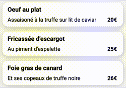
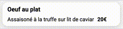

# Grasso Lilian : P3_Dynamisez-une-page-web-avec-des-animations-CSS

   

## But du projet

Intégré une maquette ainsi que ses animations

## Pour commencer

### Les maquettes

#### Page d'acceuil et un Menu

 

### Les animations
#### Apparition des menus

#### Validation d'un plat

### Contrainte technique

<ul>
  <li>Réaliser ce projet avec HTML et CSS sans utiliser de framework</li>
  <li>Aucune erreur ni alerte au validateur W3C HTML et CSS</li>
  <li>Un affichage responsive</li>
  <li>Des animations</li>
</ul>

### Pré-requis

Pour pouvoir accéder à Ohmyfood, il suffit de posséder un moteur de recherche

Par exemple:

## Se rendre sur Ohmyfood

Rien de plus simple, cliquez <a href="https://liliangrasso.github.io/P3_Dynamisez-une-page-web-avec-des-animations-CSS/">ici</a> !

## Outils utilisés 

* [Virtual studio code](https://code.visualstudio.com/) - Editeur de textes
* [FontAwseome](https://fontawesome.com/) - Pour les icons
* [Sass](https://sass-lang.com/) - Préprocesseur CSS

## Versions
**Dernière version stable :** 1.0 
Liste des versions :
[Cliquer pour afficher](https://github.com/Liliangrasso/P3_Dynamisez-une-page-web-avec-des-animations-CSS/tags)

### Code Gitmoji
:pencil: Mise à jour d'un document 
:art: Pour le CSS 
:pencil2: Pour l'html

## Auteur
* **Grasso Lilian** _alias_ [@liliangrasso](https://github.com/Liliangrasso)

## License

